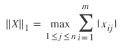
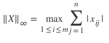
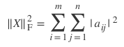

# TP0: Normas de Matrizes

Neste TP vamos relembrar um pouco dos conceitos de AEDS1. Em particular
vamos passar pelos seguintes pontos:

  1. Laços
  2. If e Else
  3. Matrizes e vetores
  4. Entrada e Saída

Este TP existe para que eu possa entender melhor como está o conhecimento no
começo do semestre.

## Datas

  * Disponível: Dia 11 de Março
  * Entrega: para o dia 21 de Março
  * Posso entregar atrasado? Não, o TP já vale pontos extra.

## O Problema

Um conceito bastante utilizado na álgebra linear é o de norma de matrizes e
vetores. Então, vamos iniciar definindo uma matriz *X*:


<!---
$$
X = \begin{bmatrix}
    x_{11}       & x_{12} & x_{13} & \dots & x_{1m} \\
    x_{21}       & x_{22} & x_{23} & \dots & x_{2m}\\
   \dots & \dots & \dots & \dots & \dots\\
    x_{n1}       & x_{n2} & x_{n3} & \dots & x_{nm}
\end{bmatrix}
$$
-->

A matriz $X$ acima tem n-linhas e m-colunas. Neste TP você vai escrever **três**
funções diferentes. Cada função é definida como uma norma de uma matriz.
Em particular, você vai implementar a norma um, norma infinito e norma
frobenius. 

Para mais informações veja o Wikipedia:
https://en.wikipedia.org/wiki/Matrix_norm

**Norma Um**



<!---
$$ \|X\|_1 = \max_{1 \leq j \leq n} \sum_{i=1}^m | x_{ij} | $$
--->

Soma da maior coluna que tem a maior soma.

**Norma Infinito**



<!---
$$ \|X\|_\infty = \max_{1 \leq i \leq m} \sum _{j=1}^n | x_{ij} | $$
--->

Soma da maior linha que tem a maior soma.

**Norma Frobenius ao Quadrado**



<!---
$$\|X\|_{\rm F}^2 =\sum_{i=1}^m\sum_{j=1}^n |a_{ij}|^2 $$
--->

Soma de todos os elementos elevados ao quadrado.

*Nos slides não elevei ao quadrado, usem esta definição*

## Entrada e Saída

A entrada do TP será um arquivo com vários casos de testes. A primeira linha do
arquivo indica o número de casos. Isto é, se a primeira linha for `5`, você vai
computar as três normas acima para 5 matrizes. Após a primeira linha, será
indicado o tamanho da primeira matriz (n-linhas e m-colunas). Cada uma das
próximas n-linhas será uma linha da matriz (cada linha com m-colunas). Após
n-linhas, o tamanho da matriz seguinte será indicado. O processo se repete até
você ler todos os casos de teste (5 no exemplo acima).

Para cada caso de teste você deve escrever um arquivo de saída. Tal arquivo vai
conter em cada linha 3 colunas indicado as três normas de cada matriz do caso de
teste. Abaixo segue um exemplo:

*Os números sempre serão inteiros*

| *Entrada* `entrada.txt` | Saída `saida.txt` |
|-------------------------|-------------------|
|3                        | 101 112  18552    |
|2 4                      | 8 7 84            |
|1 -1 90 20               | 7 7 49            |
|0 -100 1 -7              |                   |
|3 5                      |                   |
|0 0 0 -3 0               |                   |
|0 -7 0 0 0               |                   |
|0 0 1 5 0                |                   |
|1 1                      |                   |
|7                        |                   |

O nome do arquivo de entrada vai ser passado para o programa pela
linha de comando.

**No Windows**
```cmd
tp0 meuarquivodeentrada.txt meuarquivodesaida.txt
```

**No linux**
```bash
./tp0 meuarquivodeentrada.txt meuarquivodesaida.txt
```

## Pontos Importantes

1. Todo o TP pode ser feito usando apenas ```stdio.h``` e ```stdlib.h```
1. Não precisa usar nenhuma outra biblioteca
1. Isto é, implementem tudo vocês mesmo!
    1. A ideia aqui é ver como estão os conceitos base.
1. Implementa cada norma em uma função diferente.
1. Caso use uma IDE como o CodeBlocks, entregue apenas o arquivo tp0.c

## Entrega

Código

1. Seu código deve estar em um único arquivo tp0.c
1. Seu código deve estar bem documentado

Uma documentação em PDF contendo de no máximo 5 páginas contendo:

1. Como executar o TP
1. Quais foram suas deciões de implementação
1. Respostas das perguntas abaixo
1. Código do TP claro

## Perguntas

  1. **Se cada elemento da matriz ocupa 4 bytes. Quanto de espaço uma matriz n por m ocupa na memória?**
  
  1. **Imagine que n e m so valores bem grandes (acima de 10 milhões), como você faria para resolver o
       trabalho sem alocar as matrizes em memória?**
  
  1. **Olhando a função abaixo, você consegue me dizer qual é a saída para qualquer entrada n e m? Isto é, escrever a saída como uma equação.**
  
  ```c
  int nops(int n, int m) {
  	int rv = 0;
  	for (int i = 0; i < n; i++) 
  	{
  		for (int j = 0; j < m; j++) 
  		{
        for (int k = 0; k < (n + m); k++)
        {
  			  rv++;
        }
  		}
  	}
  	return rv;
  }
  ```
  
  1. **Como você adapataria seu TP para utilizar alocação dinâmica de memória? Isto é, alocar as matrizes malloc e free ao invés de matrizes C. Escreva o código de alocar a matriz**


